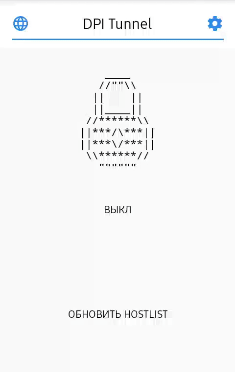

# DPI Tunnel

    

     
    

DPI Tunnel is an application for Android that uses various techniques to bypass DPI (Deep Packet Inspection) systems, which are used to block some sites.

    

## How to use

If you have root enable "Set DPITunnel proxy globally" option in DPI Tunnel settings and press on/off button.\
If you don't have root and your device has android >= 5 you need to just press on/off button.\
If you don't have root and your device has old android version you need to manually fill system proxy settings. Host is 127.0.0.1. Port specifed in "DPI Tunnel port" option, default is 8080.

## How it works

DPITunnel for Android establishes a transparent proxy server on your phone and starts local VPN server, that forwards your traffic into the proxy server, where are DPI circumvention tricks applying.

### How DPI works and some methods to bypass it

###### DNS

When you enter a URL in a Web browser, the first thing the Web browser does is to ask a DNS (Domain Name System) server, at a known numeric address, to look up the domain name referenced in the URL and supply the corresponding IP address.
If the DNS server is configured to block access, it consults a blacklist of banned domain names. When a browser requests the IP address for one of these domain names, the DNS server gives a wrong answer or no answer at all.
To overcome this problem DPI Tunnel uses DNS-Over-HTTPS technology, that sends DNS request in HTTPS packets.

###### HTTPS

DPI systems look for the Server Name Indication (SNI) field in the Client Hello packet.
To bypass DPI we can send HTTPS request by parts, because MOST DPIs can't reconstruct TCP session.

###### HTTP

There is a lot of methods.\
First, we can split request in packets.\
Second, we can modify HTTP packet, because most DPIs can extract site address only from standard HTTP packet. For example: we can replace Host: header with hOsT: or replace DOS end of line with UNIX. Don't worry, this modifications shouldn't break any website as they're fully compatible with TCP and HTTP standards.

## Links
[4PDA](https://4pda.ru/forum/index.php?showtopic=981039) (Russian forum)\
[F-Droid](https://f-droid.org/en/packages/ru.evgeniy.dpitunnel) (Open source app store)\
[Xda labs](https://labs.xda-developers.com/store/app/ru.evgeniy.dpitunnel) (Xda app store)\
[@DPITunnelOFFICIAL](https://t.me/DPITunnelOFFICIAL) (Telegram group) You may ask for help there.

## License

Licensed under the MIT license. See [LICENSE](https://github.com/zhenyolka/DPITunnel/blob/master/LICENSE "LICENSE").
